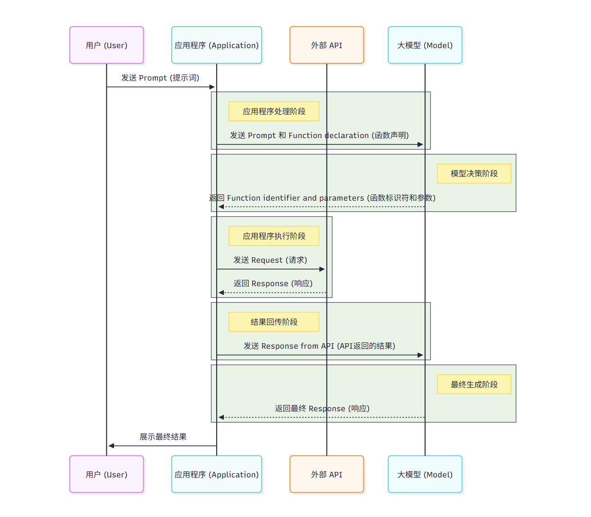

# 工具 Function Calling

大模型自身没有改变外部环境的能力


# 大模型函数调用（Function Calling）流程图



这张图展示了 **“大模型函数调用（Function Calling）”** 的完整工作流程。它描述了用户、应用程序、大模型以及外部 API 之间是如何协作来完成一个复杂任务的。

简单来说，这个流程让大模型不仅能“聊天”，还能通过调用外部工具（API）来“干活”。

以下是图中各个步骤的详细解释：

**1. 用户发起请求 (User -> Application)**
*   **动作：** 用户向应用程序发送一个 **Prompt（提示词）**。
*   **例子：** 用户可能会问：“北京现在的天气怎么样？” 这个请求首先到达应用程序。

**2. 应用程序转发给模型 (Application -> Model)**
*   **动作：** 应用程序接收到用户的提示词后，并不会直接回答，而是将 **Prompt（提示词）** 连同 **Function declaration（函数声明）** 一起发送给大模型。
*   **关键点：** “函数声明”非常重要。它告诉模型：“如果你需要查询天气，你可以使用这个叫做 `get_weather` 的函数，它需要城市名称作为参数。” 这就好比给了模型一本“工具使用说明书”。

**3. 模型决策与识别 (Model -> Application)**
*   **动作：** 大模型分析用户的意图。它意识到自己无法直接回答“天气”问题（因为它的知识可能过时，或者它没有实时数据），但它看到了应用程序提供的“函数声明”。
*   **输出：** 模型不直接回答用户，而是返回一个 **Function identifier and parameters（函数标识符和参数）**。
*   **例子：** 模型返回类似这样的信息：`{"function": "get_weather", "parameters": {"city": "北京"}}`。这表示：“我需要调用查询天气的函数，参数是北京。”

**4. 应用程序执行函数调用 (Application -> API)**
*   **动作：** 应用程序接收到模型的指令后，解析出模型想要调用的函数和参数。然后，应用程序负责实际执行这个 **Function call（函数调用）**。
*   **交互：** 应用程序向外部 **API** 发送 **Request（请求）**（例如，向气象局的数据接口发送请求，查询北京的天气）。
*   **响应：** API 返回 **Response（响应）** 给应用程序（例如，API 返回数据：“北京，晴，25度”）。

**5. 应用程序将结果回传给模型 (Application -> Model)**
*   **动作：** 应用程序拿到了 API 返回的真实数据后，会再次调用大模型。这次，它把 **Response from API（来自 API 的响应）** 作为新的上下文发送给模型。
*   **目的：** 这一步是让模型基于真实的数据来组织语言，生成最终给用户的回答。

**6. 模型生成最终回答 (Model -> Application -> User)**
*   **动作：** 大模型接收到 API 的具体数据（例如“25度，晴”），结合之前的对话上下文，生成一段自然流畅的 **Response（响应）**。
*   **例子：** 模型生成：“北京现在的天气是晴天，气温大约 25 摄氏度，非常适合出行。”
*   **最终交付：** 应用程序将这个最终响应展示给用户。

---

### **总结核心逻辑**

这张图的核心在于**“职责分离”**：
*   **大模型（Model）：** 负责**理解意图**和**决策**（决定要不要调用工具，调用哪个工具，参数是什么），以及最后的**语言组织**。它不直接接触外部数据。
*   **应用程序（Application）：** 负责**调度**和**执行**。它是连接模型和现实世界 API 的桥梁，负责真正去跑代码、拿数据。
*   **API：** 负责提供**真实、实时的数据**或执行具体操作（如订票、发邮件）。

这种机制极大地扩展了大模型的能力，让它从“百科全书”变成了能处理实际任务的“智能助手”。


# 开发

## 定义工具函数

```python
import httpx

def get_weather(latitude, longitude):
    # 补全了截图中被遮挡的 URL 参数部分
    url = f"https://api.open-meteo.com/v1/forecast?latitude={latitude}&longitude={longitude}&current=temperature_2m"
    response = httpx.get(url)
    data = response.json()
    # 提取当前温度并格式化返回
    return f"{data['current']['temperature_2m']}℃"

# 北京的真实经纬度
beijing_lat = 39.9042
beijing_lon = 116.4074

# 调用函数并打印结果
temperature = get_weather(beijing_lat, beijing_lon)
print(f"北京当前的天气温度是: {temperature}")
```

## JSON Schema 格式描述函数

```JSON Schema
tools = [{
    "type": "function",  # 声明类型为函数
    "function": {
        "name": "get_weather",  # 函数名称
        "description": "根据指定的坐标提供当地摄氏温度",  # 函数描述（供大模型判断何时调用）
        "parameters": {  # 函数参数定义
            "type": "object",  # 参数整体类型为对象
            "properties": {  # 具体的参数属性
                "latitude": {"type": "number"},  # 纬度（数字类型）
                "longitude": {"type": "number"}  # 经度（数字类型）
            },
            "required": ["latitude", "longitude"],  # 必填参数：纬度和经度
            "additionalProperties": False  # 禁止传入未定义的额外参数
        },
        "strict": True  # 开启严格模式，强制大模型输出符合规范
    }
}]
```


## 封装 LLM

```python
from openai import OpenAI

# 使用变量保存历史记录（用于实现多轮对话上下文）
message_history = []

# 发送消息给大模型，并自动保存记录
def get_completion(message):
    # 1. 将用户的最新提问追加到历史记录列表中
    message_history.append(message)
    
    # 2. 调用大模型接口
    response = client.chat.completions.create(
        model="deepseek-flash",          # 指定要使用的大模型名称
        messages=message_history,   # 传入历史记录，让大模型知道之前的对话上下文
        tools=tools,                # 传入可用工具列表
    )

    # 3. 提取大模型返回的消息内容，并转换为字典格式
    response_dict = dict(response.choices[0].message)
    
    # 4. 将大模型的回答也追加到历史记录中，以便下一轮对话使用
    message_history.append(response_dict)
    
    # 5. 返回大模型的回答字典
    return response_dict
```


## 调用 LLM

```python
import json  # 导入 json 模块，用于解析大模型返回的参数字符串

# 1. 发起第一轮对话：用户提问
# 调用之前定义的 get_completion 函数，向大模型发送用户的提问
message = get_completion({"role": "user", "content": '今天北京天气如何'})
print(message)  # 打印大模型的返回结果，此时大模型会返回“工具调用信息”而非直接回答

# 2. 解析大模型返回的工具调用信息（从 message 字典中提取）
# 获取本次工具调用的唯一 ID，后续把执行结果传回给大模型时需要带上这个 ID 作为匹配
func_call_id = message['tool_calls'][0].id

# 提取大模型决定调用的函数参数（它是一个 JSON 格式的字符串），并使用 json.loads 将其转换为 Python 字典
func_kwargs = json.loads(message['tool_calls'][0].function.arguments)

# 3. 在本地执行真正的 Python 函数
# 使用 ** 操作符将字典拆解为关键字参数传入（即传入 latitude 和 longitude），去调用真实的 get_weather 函数获取天气
func_result = get_weather(**func_kwargs)

print("分隔线-----------")

# 4. 发起第二轮对话：将本地函数的执行结果返回给大模型
# 构造一个 role 为 "tool" 的消息。注意：必须带上刚才的 func_call_id，并且把函数执行结果转为字符串放入 content 中
message = get_completion({"role": "tool", "tool_call_id": func_call_id, "content": str(func_result)})

# 5. 打印大模型最终的回复
# 大模型接收到真实的天气数据后，会结合上下文，生成最终的自然语言回答
print(message)
```


## 完整过程

```python

import json
import httpx
from openai import OpenAI

# ==========================================
# 1. 初始化 OpenAI 客户端
# ==========================================
client = OpenAI(
    api_key="sk-fxxx", 
    base_url="https://api.deepseek.com"
)

# ==========================================
# 2. 真实的本地工具函数：调用外部 API 获取天气
# ==========================================
def get_weather(latitude, longitude):
    # 补全了 API 参数，直接获取当前温度
    url = f"https://api.open-meteo.com/v1/forecast?latitude={latitude}&longitude={longitude}&current=temperature_2m"
    response = httpx.get(url)
    data = response.json()
    # 提取当前温度并格式化返回
    return f"{data['current']['temperature_2m']}℃"

# ==========================================
# 3. 大模型的工具声明 (告诉模型有 get_weather 这个工具可用)
# ==========================================
tools = [{
    "type": "function",
    "function": {
        "name": "get_weather",
        "description": "根据指定的坐标提供当地摄氏温度",
        "parameters": {
            "type": "object",
            "properties": {
                "latitude": {"type": "number"},   # 纬度
                "longitude": {"type": "number"}   # 经度
            },
            "required": ["latitude", "longitude"],
            "additionalProperties": False
        },
        "strict": True
    }
}]

# ==========================================
# 4. 历史记录与请求封装函数
# ==========================================
# 使用变量保存历史记录（实现多轮对话上下文）
message_history = []

def get_completion(message):
    # 将最新的消息追加到历史记录中
    message_history.append(message)
    
    # 调用大模型接口
    response = client.chat.completions.create(
        model="deepseek-flash",          # 使用 deepseek-flash
        messages=message_history,   # 传入历史记录
        tools=tools,                # 传入可用工具列表
    )

    # 将大模型返回的 message 对象转换为字典格式
    response_dict = dict(response.choices[0].message)
    
    # 将大模型的回答也追加到历史记录中
    message_history.append(response_dict)
    
    return response_dict

# ==========================================
# 5. 主程序：执行完整的 Function Calling 闭环
# ==========================================
# 控制代码的执行时机
# __name__ 是 Python 每个模块（.py 文件）都自带的一个内置变量：
# 当文件被直接运行时（比如 python test.py），__name__ 的值就是 "__main__"
# 当文件被 import 导入时（比如 import test），__name__ 的值就是模块名 "test"
if __name__ == "__main__":
    print("--- 步骤 1：用户提问 ---")
    # 用户提问
    message = get_completion({"role": "user", "content": '今天北京天气如何'})
    print(message)  # LLM 返回工具调用信息
    print("\n")

    print("--- 步骤 2：解析工具调用参数并本地执行 ---")
    # 提取工具调用 ID
    func_call_id = message['tool_calls'][0].id
    # 提取参数 (大模型返回的是 JSON 字符串，需要用 json.loads 转成字典)
    func_kwargs = json.loads(message['tool_calls'][0].function.arguments)
    
    # 本地执行真实的 Python 函数 (使用 ** 解包字典参数)
    func_result = get_weather(**func_kwargs)
    print(f"本地执行结果: {func_result}")
    print("\n")

    print("--- 步骤 3：将执行结果返回给大模型，获取最终回答 ---")
    # 构造 role 为 "tool" 的消息，将真实的天气结果回传给大模型
    message = get_completion({
        "role": "tool", 
        "tool_call_id": func_call_id, 
        "content": str(func_result)
    })
    
    # 大模型结合真实数据，生成最终的自然语言回答
    print(message)  # LLM 返回最终回答
```


## 开发流程总结

这段代码展示了 Function Calling 的核心闭环：

用户提问 ➔ 模型要参数 ➔ 本地跑代码查天气 ➔ 结果喂回给模型 ➔ 模型生成最终人话回答。