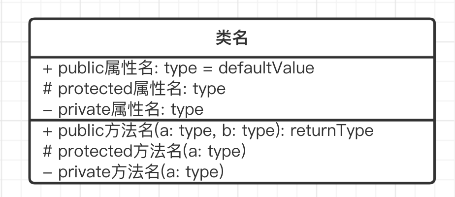
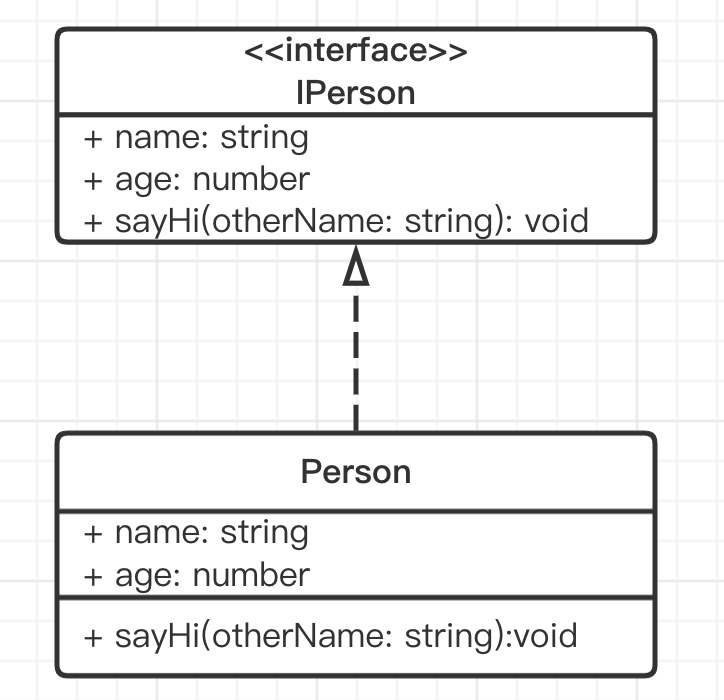

## 面向对象编程

Object-Oriented-Program（简称 OOP）是一种目前主流的编程思想。
已有几十年的历史，1990 年代开始，和 Java 一起开始发展壮大。

编程本来是抽象的，像做数学题一样。 一开始的汇编语言，直接操作寄存器、内存，写底层计算。后来的 C 语言，各种函数和指针。

而 OOP 引入了“对象”概念，对象即对应生活中的实物，这样就把编程具象化了。 具象化之后学习成本就低了，也就随着计算机革命普及开来。

设计模式就是基于 OOP 编程思想的，不适用于其他编程思想（如函数式编程）


## 三要素

### 继承

super 实现

抽离公共代码，实现代码复用。比如公共的方法写成一个类，让多个子类去继承它，改的时候只改一个地方就可以了，还能减少代码体积。
```ts
class Student extends People {
    school: string

    constructor(name: string, age: number, school: string) {
        super(name, age)
        this.school = school
    }
    study() {
        alert(`${this.name} study`)
    }
}
// 可继续派生其他子类

let xiaoming = new Student('xiaoming', 10, 'A小学')
xiaoming.study()
console.log(xiaoming.school)
let xiaohong = new Student('xiaohong', 11, 'B小学')
xiaohong.study()
```

### 封装

就是通过修饰符或类似的方法实现的

- `public` 外部可访问，默认
- `protected` 内部或子类可访问
- `private` 只有内部可访问


高内聚，低耦合

- 高内聚：当一个模块乱自己乱就好了，不要影响到别的模块
- 低耦合：减少模块之间的联系
- 例如一个大船下面的仓是分离的，一个出问题不会影响到其他仓，可以继续行驶。


### 多态

重写 - 覆盖父组件的方法，例如父类里的方法不适应子类时，在子类里重新定义父类的方法，以保证扩展性。
重载 - 支持多种参数形式

```ts
interface IStyleInfo {
    [key: string]: string
}

class JQuery {
    // 函数重载
    css(key: string, value: string)
    css(styleInfo: IStyleInfo)
    css(keyOrStyleInfo: string | IStyleInfo, value?: string) { 
        if (typeof keyOrStyleInfo === 'string') {
            // key-value 形式
            const key = keyOrStyleInfo
            console.log('Set CSS', key, value)
        } else {
            // object 形式
            const styleInfo = keyOrStyleInfo
            for (const key in styleInfo) { 
                const value = styleInfo[key]
                console.log('Set CSS', key, value)
            }
        }
    }
}

const jquery = new JQuery()
jquery.css('color', 'red')
jquery.css({ color: 'red', 'font-size': '14px' })
```


## UML-类图

UML - Unified Modeling Language - 统一建模语言

是一种为面向对象系统的产品进行说明、可视化和编制文档的一种标准语言。

### UML 类图的作用

- 需求指导设计，设计指导开发
- 开发之前，写技术方案设计文档，并评审
- UML 类图就是一个重要的工具和表达方式。如果你和同事都熟悉 UML 类图，那会减少很多沟通成本，不用看代码就可以知道你的代码结构，核心属性和方法


### 单个类画法

三个区域
- 类名
- 属性
- 方法

权限描述
- `+` public
- `#` protected
- `-` private




### 类实现接口

注意：TS 的 interface 和 Java 的不一样，TS 有属性，而 Java 的没有属性只有函数。而 UML 类图是依据 Java 语法而画的（没有属性区域）。

虚线 + 空心箭头 就是类实现接口
```ts
interface IPerson {
    name: string
    age: Number
    sayHi (otherName: string): void
}

class Person implements IPerson {
  name: string
  age: Number
  constructor (name: string, age: Number) {
    this.name = name
    this.age = age
  }
  sayHi (otherName: string) {
    alert(`hi`)
  }
  // 实现接口后，还可以写点别的
  eat () {}
  speak () {}
}
```
