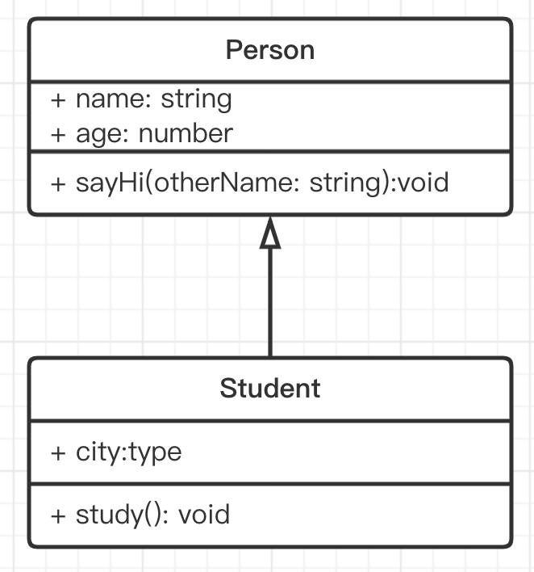
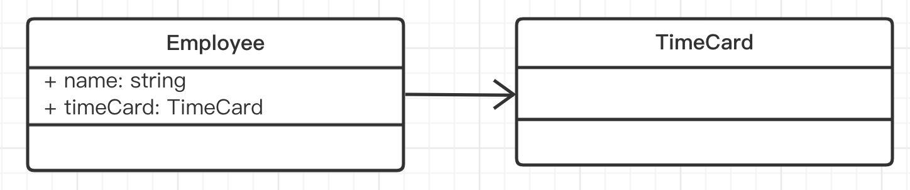
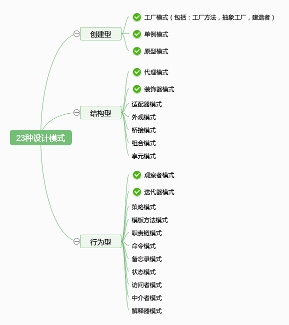

## 面向对象编程

Object-Oriented-Program（简称 OOP）是一种目前主流的编程思想。
已有几十年的历史，1990 年代开始，和 Java 一起开始发展壮大。

编程本来是抽象的，像做数学题一样。 一开始的汇编语言，直接操作寄存器、内存，写底层计算。后来的 C 语言，各种函数和指针。

而 OOP 引入了“对象”概念，对象即对应生活中的实物，这样就把编程具象化了。 具象化之后学习成本就低了，也就随着计算机革命普及开来。

设计模式就是基于 OOP 编程思想的，不适用于其他编程思想（如函数式编程）


## 类和对象

类，即模板

```ts
class People {
    name: string
    age: number

    constructor(name: string, age: number) {
        this.name = name
        this.age = age
    }

    eat() {
        alert(`${this.name} eat something`)
    }

    speak() {
        alert(`My name is ${this.name}, age ${this.age}`)
    }
}
```

对象，即实例。一个类可以 `new` 出很多个对象。

```ts
// 创建实例
let zhang = new People('zhang', 20)
zhang.eat()
zhang.speak()

// 创建实例
let wang = new People('wang', 21)
wang.eat()
wang.speak()
```


## 三要素

### 继承

super 实现

抽离公共代码，实现代码复用。比如公共的方法写成一个类，让多个子类去继承它，改的时候只改一个地方就可以了，还能减少代码体积。
```ts
class Student extends People {
    school: string

    constructor(name: string, age: number, school: string) {
        super(name, age)
        this.school = school
    }
    study() {
        alert(`${this.name} study`)
    }
}
// 可继续派生其他子类

let xiaoming = new Student('xiaoming', 10, 'A小学')
xiaoming.study()
console.log(xiaoming.school)
let xiaohong = new Student('xiaohong', 11, 'B小学')
xiaohong.study()
```

### 封装

就是通过修饰符或类似的方法实现的

- `public` 外部可访问，默认
- `protected` 内部或子类可访问
- `private` 只有内部可访问


高内聚，低耦合

- 高内聚：当一个模块乱自己乱就好了，不要影响到别的模块
- 低耦合：减少模块之间的联系
- 例如一个大船下面的仓是分离的，一个出问题不会影响到其他仓，可以继续行驶。


### 多态

重写 - 覆盖父组件的方法，例如父类里的方法不适应子类时，在子类里重新定义父类的方法，以保证扩展性。
重载 - 支持多种参数形式

```ts
interface IStyleInfo {
    [key: string]: string
}

class JQuery {
    // 函数重载
    css(key: string, value: string)
    css(styleInfo: IStyleInfo)
    css(keyOrStyleInfo: string | IStyleInfo, value?: string) { 
        if (typeof keyOrStyleInfo === 'string') {
            // key-value 形式
            const key = keyOrStyleInfo
            console.log('Set CSS', key, value)
        } else {
            // object 形式
            const styleInfo = keyOrStyleInfo
            for (const key in styleInfo) { 
                const value = styleInfo[key]
                console.log('Set CSS', key, value)
            }
        }
    }
}

const jquery = new JQuery()
jquery.css('color', 'red')
jquery.css({ color: 'red', 'font-size': '14px' })
```


## UML-类图

UML - Unified Modeling Language - 统一建模语言

是一种为面向对象系统的产品进行说明、可视化和编制文档的一种标准语言。

### UML 类图的作用

- 需求指导设计，设计指导开发
- 开发之前，写技术方案设计文档，并评审
- UML 类图就是一个重要的工具和表达方式。如果你和同事都熟悉 UML 类图，那会减少很多沟通成本，不用看代码就可以知道你的代码结构，核心属性和方法

https://www.processon.com/

### 单个类-画法

三个区域
- 类名 | 属性 | 方法

权限描述
- `+` public
- `#` protected
- `-` private


介绍常见的三种
实现 | 泛化 | 关联

### 类实现接口-画法

注意：TS 的 interface 和 Java 的不一样，
TS 有属性，而 Java 的没有属性只有函数。
而 UML 类图是依据 Java 语法而画的（没有属性区域）。

虚线 + 空心箭头 就是类实现接口
```ts
interface IPerson {
    name: string
    age: Number
    sayHi (otherName: string): void
}

class Person implements IPerson {
  name: string
  age: Number
  constructor (name: string, age: Number) {
    this.name = name
    this.age = age
  }
  sayHi (otherName: string) {
    alert(`hi`)
  }
  // 实现接口后，还可以写点别的
  eat () {}
  speak () {}
}
```


### 类继承（泛化）-画法

```ts
class People {
  name: string
  age: number
  constructor (name: string, age: number) {
    this.name = name
    this.age = age
  }
  sayHi (otherName: string) {
    alert(`sayHi`)
  }
}

class Student extends People {
  school: string
  constructor (name: string, age: number, school: string) {
    super(name, age)
    this.school = school
  }
  study () {
    alert(`study`)
  }
}
```




### 类引用（关联）-画法

```ts
class Employee {
  name: 
  // 引用类
  timeCard: TimeCard
  constructor (name: string, timeCard: TimeCard) {
    this.name = name
    this.timeCard = timeCard
  }
}

class TimeCard {
  // ...
}
```



注意：不同类图之间的连接线和箭头的区别

类实现：虚线&空心箭头
类泛化（继承）：实线&空心箭头
类关联（引用）：实线&普通箭头


## 设计原则

设计原则是设计模式的前提

要知道设计模式的前因后果，是为了解决什么问题，所以要先说清楚设计原则。


### SOLID 五大设计原则


设计原则：先有设计原则，然后才有模式（各种固定套路，每个套路就是一个模式）


S 单一职责原则
  - 一个程序只做好一件事
  - 如果功能过于复杂就拆分开
  - 每个部分保持独立。

O 开放封闭原则（最重要的一个设计原则）
  - 如果需求有一个新功能，要对拓展开放，对修改封闭。
  - 例如 增加新功能时候拓展一个新的模块去做，再把模块组合起来就可以完成新的功能。而不要去修改原来的模块。
  - 所以 SO 之间是相辅相成，如果模块不够独立也是拓展不了的。
  - 为什么不要去修改，因为修改已有的模块可能会造成新的 bug，这也是我们日常开发时常遇到的痛点。从整个软件开发流程看，减少现有逻辑的更改，也会减少测试的成本。

L 李氏置换原则
  - 子类能覆盖父类，父类能出现的地方子类就能出现 —— 前端应用较少。

I 接口隔离原则
  - 保持接口的单一独立，避免出现“胖接口”。类似于单一职责原则，只不过前者说的比较统一，后者是单独对接口的规定。JS 中没有接口，因此体现较少。

D 依赖倒置原则
  - 函数的参数尽量依赖于一个接口（抽象），而非一个类（具体），拓展性更好一些。
  ```ts
  function fn(p: Student) {} // 依赖具体的类
  function fn(p: IPerson) {} // 依赖接口
  ```


### 举例说明

以常见的 Promise 来解释一下前两个原则（SO）。
```ts
// 加载图片
function loadImg(src: string) { 
    const promise = new Promise((resolve, reject) => {
        const img = document.createElement('img')
        img.onload = () => { 
            resolve(img)
        }
        img.onerror = () => { 
            reject('图片加载失败')
        }
        img.src = src
    })
    return promise
}

const src = 'xxx/xxx/x.png'

const result = loadImg(src)
// @ts-ignore
result.then((img: HTMLImageElement) => {
    console.log('img.width', img.width)
    return img
}).then((img: HTMLImageElement) => {
    console.log('img.height', img.height)
}).catch((err) => {
    console.log(err)
})
```
- 单一职责原则：每个`then`中的逻辑只做好一件事，如果要做多个就用多个`then`
- 开放封闭原则：如果这个需求要修改，那去扩展`then`即可，现有的逻辑不用修改，即对扩展开放、对修改封闭

总结：设计模式不一定要用，但要尽量写出符合设计原则的代码


小即是美
要简单简洁，不要写那么多别人看不懂的东西，来体现自己的技术优越性，可能只会短期内让自己心情比较舒服，没什么收益，可能不久不用就会忘记。每个模块写的小一些，简单些，让别人一看就懂，所有美好的事物都是简单精简的。
拆出小的模块，也会提高模块复用的可能性，产生杠杆效应后，发现前面做的拆分都是值得的。

- 让每个程序只做一件事


### Unix/Linux 设计哲学


### 23 种设计模式

1995 年，四位前辈出版了一本书《设计模式：可复用面向对象软件的基础》，里面总结了常用的 23 种设计模式，被后人一直沿用至今。

- 创建型模式
    - **工厂模式**（包括：工厂方法模式，抽象工厂模式，建造者模式）
    - **单例模式**
    - **原型模式**
- 结构型模式
    - 适配器模式
    - **装饰器模式**
    - **代理模式**
    - 外观模式
    - 桥接模式
    - 组合模式
    - 享元模式
- 行为型模式
    - 策略模式
    - 模板方法模式
    - **观察者模式**
    - **迭代器模式**
    - 职责连模式
    - 命令模式
    - 备忘录模式
    - 状态模式
    - 访问者模式
    - 中介者模式
    - 解释器模式




1995 年还没有前端，所有当时的一些设计模式，并不完全适用于现在。而且，前后端也有区别。

所以，前端最常用的设计模式，就大概以下7种：
- 工厂模式
- 单例模式
- 原型模式
- 装饰器模式
- 代理模式
- 观察者模式
- 迭代器模式


分开理解：
- 先有设计 再有模式

- 设计：是设计原则
- 模式：是前辈们总结出来的固定套路，直接套用。

- 设计+模式 = 依据设计原则而来的几个固定的套路


# 总结：

只掌握前端常用到设计模式即可，23种不需要全部掌握，因为这些设计模式，没有使用场景很快就会忘记。

本次分享主要是给之前没有了解过设计原则和设计模式、面向对象、UML类图的同学。帮助大家平缓的容易的去理解这些抽象的原则模式。

大型的系统，随着需求的增长，维护人员的增多，每个模块发生了一些混乱，是正常的事情。这种情况也就能体现出来设计的价值，好的设计只会模块混乱，不会导致全局混乱，即使模块混乱，重构也只重构这个模块即可。


学设计模式的好处，套用前人经验，减低设计和沟通成本，讨论技术方案的时候，一说什么模式大家都知道，不需要去解释。

需求 => 设计 => 开发

尝试着写设计方案，不要觉得会浪费时间，一般一个项目或功能2周左右的开发周期会需要这个东西，即使延期也不会是因为写技术方案的几个小时就延期了，有了技术方案就有了前置思考的过程，比如考虑一些异常情况，不要漏掉，再比如评审方案的时候某个梗点恰好别人做过，直接去参考就好了。

