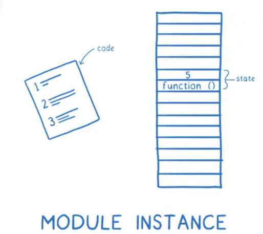

# ESM 是什么

为 JS 带来了一个正式的、规范化的模块系统。

# ESM 是如何工作的

ESM 在工作过程中，一共需要三大阶段：

1. 构建
2. 实例化
3. 计算

## 构建（Construction）

在构建阶段，每个模块会发生三件事情

1. 弄清楚从哪里下载模块文件（又称为模块解析）
2. 获取文件（从 URL 下载或者从文件系统加载）
3. 将文件解析为模块记录

### 查找文件并获取文件（1、2）

loader 负责查找文件和下载文件，首先需要找到入口文件，在 HTML 中通过  来告诉浏览器文件在哪里。接着通过 import 找到 main.js 依赖的模块，这就是 import 语句的作用。但是在解析文件之前，并不知道 main.js 依赖了哪些模块，因此需要先解析，再下载所依赖的模块文件。
这就意味着需要一层一层的遍历树，解析一个文件，然后找出它的依赖项，然后查找文件并下载，这样就构建完成了一个依赖关系图。

那么此时如果主线程一直在等待下载文件，那么将会阻塞线程。这样阻塞主线程就导致程序会运行的很慢。这也是 ESM 将算法分为多个阶段的原因。

注意：CJS就不一样了，因为在文件系统中读取的文件比网络请求要快得多，所以 Node.js 在加载文件时可以阻塞主线程。所以 CJS 是挨个文件去下载-实例化-计算，直至遍历完成整棵依赖树。

经以上所述，所以 CJS 中的 require 标识符中，可以使用变量。这是因为在寻找下一个模块之前，该模块就已经执行了除了 require 之外的所有代码，因此在执行下一个模块解析（require）的过程中，变量是有值的。

但是在使用 ESM 时，在进行计算阶段（找出变量和执行语句的联系）之前，只是先通过 import 构建出整个模块依赖关系图，并不执行除 import 语句之外的代码。这就意味着模块标识符中的变量还没有值。

新提议 import() 动态导入则不一样，实现原理是使用 import() 加载的任何文件都作为单独依赖图的入口。动态导入的模块就如同导入了一个依赖图的入口文件，该依赖图将会单独处理。

### 解析（3）

现在已经获取到了文件，但是文件本身浏览器是无法直接用的，因此还需要解析这些文件，将它们转换为称之为（模块记录）的数据结构，这有助于浏览器理解模块之间的不同点，也是缓存功能。创建模块记录后，会将模块记录放在模块映射中，下次再看到同一个模块，就可以直接将这个模块映射从模块记录中拉出来。

## 实例化

这一步是实例化这个模块并将所有实例链接到一起

当你在使用模块化进行开发时，你将会构建一个依赖关系图，不同依赖项之间的连接来自于导入语句。

这些导入语句让浏览器和 Node 知道需要加载哪些代码，你给它们一个文件的地址，它们去追踪这些文件。

但是文件本身浏览器是无法直接用的，因此还需要解析这些文件，将它们转换为称之为（Module Record 模块记录）的数据结构。这样，它们就知道文件中发生了什么。

在构建阶段，每个模块会发生三件事情

- 弄清楚从哪里下载模块文件（又称为模块解析）

# 如何构建依赖关系图？

import 语句的一部分称为模块说明符，他告诉 loader 在哪里可以找到下一个模块。需要一层一层的遍历树，解析一个文件，然后找出它的依赖项，然后查找文件并下载

这种将算法分割为多个阶段的方法就是 ESM 和 CJS 的主要区别之一。

- 获取文件（从 URL 下载或者从文件系统加载）
- 将文件解析为模块记录

- 实例化（Instantiation）：将导出的变量指向内存中（但是不会填充值），然后将导出和导入指向这个内存，这就是所谓的链接（Linking）。

之后，将模块记录转换为模块实例，一个实例兼备两件事情：代码和状态。

代码基本是一组指令的集合。

状态是变量在任何时间点的实际值，也就是保存在内存中的值。

因此，模块实例将 代码（指令列表） 和 状态（所有变量的值） 组合在一起。

所以在加载这个模块的时候，就从一个文件变成了一个模块实例。

- 计算（Evaluation）：运行代码，用实际的值来填充到内存中

运行代码，用实际的值来填充到内存中

# 为什么说是异步的

我们都说 ES 模块是异步的，你可以把它看作是异步的，因为工作被分为了三个阶段——构建、实例化、计算。这些阶段可以分别完成。如果主线程一直在等待下载文件，那么将会线程阻塞。这是因为在浏览器运行中，下载需要耗费很长一段时间。这样阻塞主线程就导致程序会运行的很慢。这也是 ESM 将算法分为多个阶段的原因。

而 CJS 则不是异步的，因此在 CJS 规范中，一个模块和它的依赖关系是一次性构建、实例化和计算的，中间没有任何间断。

# 为什么模块标识符（from './xx'）不可以是变量

在 CJS 中的 require 的模块标识符中，可以使用变量。这是因为在寻找下一个模块之前，该模块就已经执行了除了 require 之外的所有代码，因此在执行模块解析的过程中，变量是有值的

但是在使用 ESM 时，在进行任何计算阶段之前，需要先构建出整个模块图。这就意味着不能在模块标识符中存在任何变量，因为这些变量还没有值。

为了让 ESM 做到这一点，有一个动态导入的提议。import(`${path}/foo.js`)