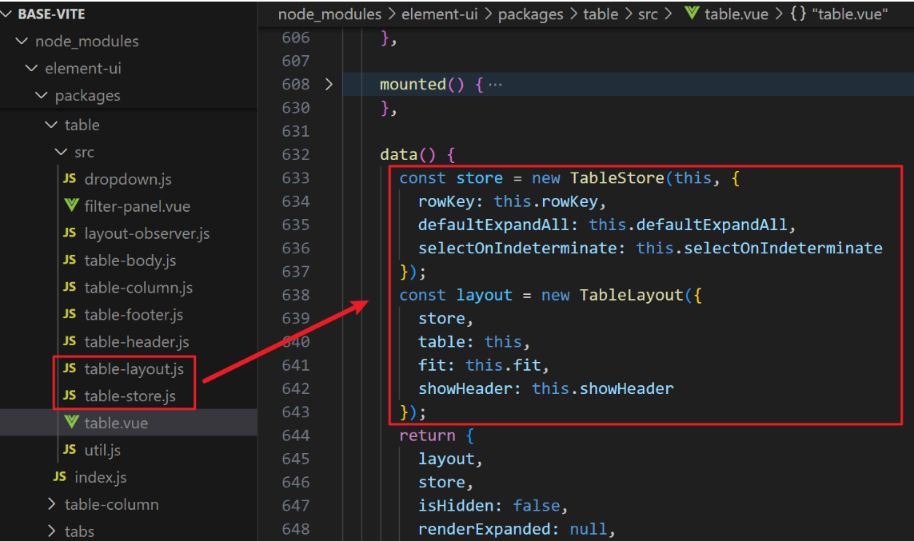
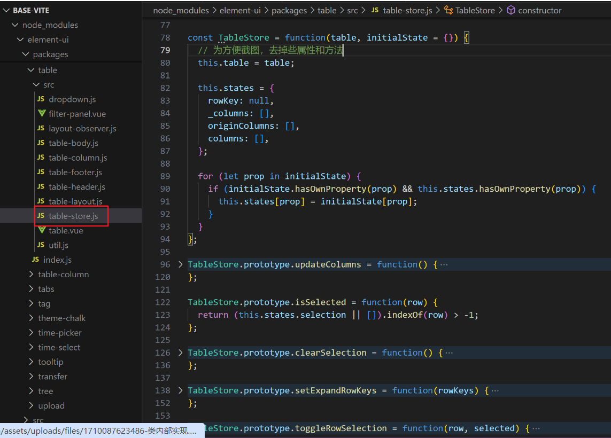
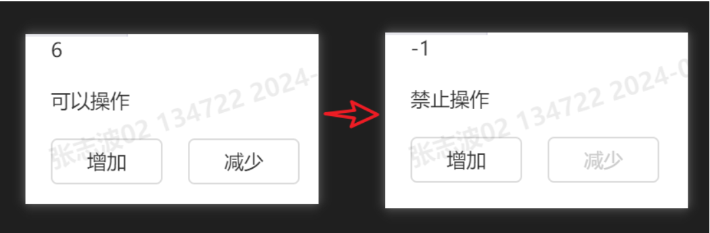
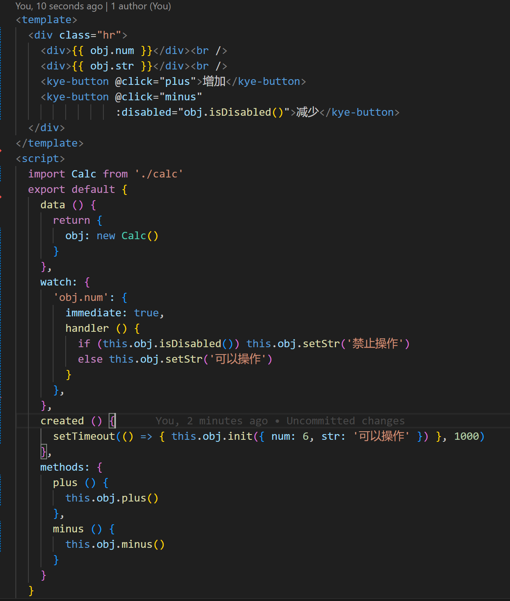
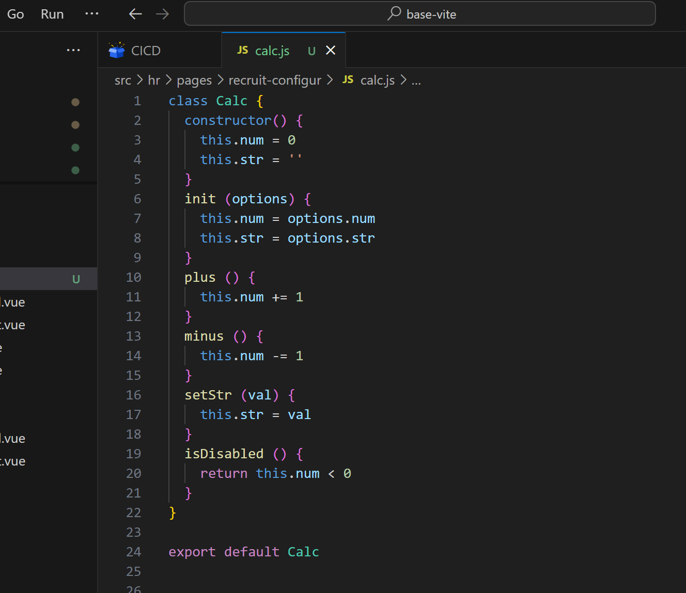

## **对业务代码分离的思考**

### 前言

23 年上半年，在日常学习和总结后，有幸在线下和大家讨论了《走进设计模式》这个主题。其中的内容大多是借用模式里的思想对日常开发中遇到的场景进行代码改造，使代码变得易读具拓展性。比如if嵌套用策略模式改造，但这些也大多是些代码风格上的变化。

说来惭愧，如今过去了近一年的时间，我还在沉醉于把代码写的更简洁漂亮的层面上较真。

### 转折点

转折点来了，项目原因，最近搬到 4 楼办公，某天一位高人路过，看到我在编码，寒暄几句后，提到了这样一个问题，“你看你这个 vue 文件里有 UI 视图，也有业务逻辑，有没有想过怎样把它们分离”

我心想不就是把处理函数提到外部文件，通过模块引入再调用，我有做啊！你看 import 这不是引入了一堆小函数么。然而不是的。

随着高人的耐心点拨，我也逐渐领会到了真正意义上的分离，随即有了这些思考，写篇文章记录下来。

### 问题

先来思考一个问题，大家日常开发铸剑都是在这个 Vue 框架里面拓展和填充模块。
当有一天需求来了，需要在轻应用也需要开发相同的模块，只是移动端视图呈现不一样，核心业务处理逻辑一致。
对于这种需求我们平时是怎么做的，把一块块的业务逻辑代码挨个 CV 到轻应用？那如果轻应用的框架不是 vue 而是 react 呢？复制过去再调整框架语法？

上述提到的场景，也是本篇文章想探讨的问题之一。

### 案例分析

**一： ElementUi**

ElementUi 的 Table 组件我们都用过，一般是把一些表格的基本参数和数据传进去，表格拿这些数据进行初始化渲染，可能还有一些排序等各种各样的交互。

来看下它是怎么做的。

 

 

看类里面做的事情，其实就是初始化一些表格需要用到的宽高属性等各种数据，再定义一些表格的交互行为、状态判断等，也就是所谓的业务逻辑。

我们发现 这两个文件是脱离了任何框架的纯 JS 文件，那么是不是可以说，这两个文件被复用的可能性已经不局限于使用者的框架了。

上图可以看到 122 行原型上有一个 isSelected 方法，通过语义化的命名可以猜到，用于判断选中状态的。

由此再做一个设想，假如类似 isSelected 这种返回布尔值的判断有十几种，那是不是也可以把它们再独立出一个类 class TableStatus

到了这一步，相信大家也对业务层分离有了一定的理解。

**二：Vue 响应式系统**

有读过2.0源码的同学应该清楚它的响应式实现还是较为复杂的，来看看它是怎么做模块分离的

它的实现是是分成了 3 个类

* Observe 类
用于数据劫持设置响应式数据（包括数组的处理方式。对象的处理方式）

* dep 类
用于数据触发后维护 Watcher 队列（追加、调用更新）

* Watcher 类
内部 get 方法触发数据的 getter，再用 dep 类 收集 Watcher， update 数据变化执行当前 cb 更新

3 个类之间进行绑定和调用，就组成了 Vue 响应式系统

### 案例总结

通过上面两个案例可以看出，主流的框架都是采用面向对象的形式，将一个系统抽象为许多对象的集合，每一个对象代表了这个系统的特定方面。对象包括函数（方法）和数据。

### 实际开发

那么到实战了，如何把这个思想带入到日常业务开发中，下面简单写个例子助于理解。

页面可以通过 加/减 按钮 对页面数字改变，当数字小于 0 时，减按钮置灰，并且页面文案改变。

 

vue 文件

 

calc 文件

 

上面通过把一个小型数值类操作模型抽象出来，从某种程度上实现了业务层与视图层的分离。

### 最终总结

相信有了这种思想后，对自身的帮助也是多方位的。

* 设计方案
日常工作中，拿到产品的需求原型后，就大致可以在设计方案阶段，设想出这个模块可能划分出几个方面，怎样去使用。

* 源码学习
学习源码的时候，当你理解了作者抽象分类的作用时，就有了全局看事物的思维，而不单纯较真每一行代码做的事情，这样对源码的理解也更深刻些。