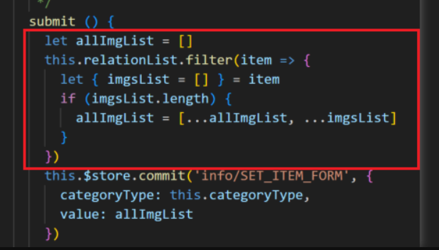

## **近期一些代码块的重构**

### 前言 ###

在日常迭代中，大家总会看到一些经过岁月较难维护的历史代码，种种原因，多数人会选择在现有基础上继续叠加新逻辑，久而久之让维护变的越发艰难。本篇主要是列出几个近期对一些历史代码块的重构改造，话不多说直接上案例。


### 先来个开胃小菜 ###

看下面红框圈住的代码，日常维护的时候如果遇到这块代码，大家猜一下这是在做什么事情。

 

-
-
-
-
-
-
-
-
-
-
-
-
-
其实是在把一个嵌套的数组对象进行打平。

也就是数组降维，是有现成的 API 的，用 ES10 Array.prototype.flatMap() 一行代码就可以实现了。

 


### 弹窗的打开方式 ###

经常会看到下图这种打开弹窗的方式，把展示状态定义在弹窗组件中，通过 ref 直接操作。

 

这种方式当然可以达到控制弹窗显隐的目的，但弹窗是一个组件，既然封装组件那就要尽可能的纯粹，尽量不包含业务逻辑，通过 ref 直接操作就多了些耦合性，较为合理的是当点击关闭时，通知父组件，父组件再去执行关闭操作。

**下图是改造后**

 

我这里是通过 .sync 修饰符结合计算属性的 getter setter 方式完成对弹窗状态的控制

- .sync 只是语法糖，其实本质上还是注册事件，不清楚的可以去看看文档介绍。

- computed 为啥可以这样用？因为 initComputed 的时候为每个 computed[key] 创建了 new Watcher() 实例，感兴趣也可以去看看源码。


### 数据处理 ###

看一个相对复杂些的数据处理

**需求：**
需要把 图一、图二 的数据格式，通过映射关系合并为图三的数据结构。

**映射关系**
```js
// 基本信息
"10": "basicInformation",
// 求职信息
"20": "jobApplicationInformation", 
// 亲友在职
"40": "rctTemplateKinship", 
// 联系人信息
"50": "rctTemplateContactInformation", 
```
- 图一


- 图二


- 图三


**先来看看旧实现方案**

- 定义映射对象


- 入口


- 处理过程


**经过改造后**

- 定义映射关系


- 入口


- 处理过程


经过分析，其实整个过程大致只做了两件事情

- 先对象转数组
用非常好用的 reduce 就可以胜任，日常处理数据我使用它的频率还是比较高的。

- 通过后端定义的映射关系返回一个新数组
一听到原数组的基础上返回一个新数组，瞬间就会想到 map 基本每天都在用的 api。

### 章末总结 ###

虽然上面几个场景的旧实现方式也能完成需求，但大家还是尽量选用一些语义化的 api，少些辅助变量和代码嵌套，使代码更易阅读维护。就像 async/await 的出现一样，promise 难道不够用么，promise 套用多了，不又回到了类似回调地狱的写法了，变得难以读懂维护，所以 ECMAScript 不断出现的新 API 大多也是为了解决我们日常开发存在的问题，而在进化。如果非要说是重视性能去选用什么 for 循环之类的，那完全没必要，因为就大家日常处理的这点数据量，浏览器根本不 care，当然以上也只是我的浅见，欢迎大家评论区讨论。

### 最后 ###

其实大家平时开发维护，都可以怀着质疑的态度去看别人的代码，想着换成自己会怎样做，善用自己的基础知识去分析解惑，平时搬砖就已经很枯燥了，也算给自己找点乐子，多思考就会有收获。（质疑 - 理解 - 分析 - 重构）
