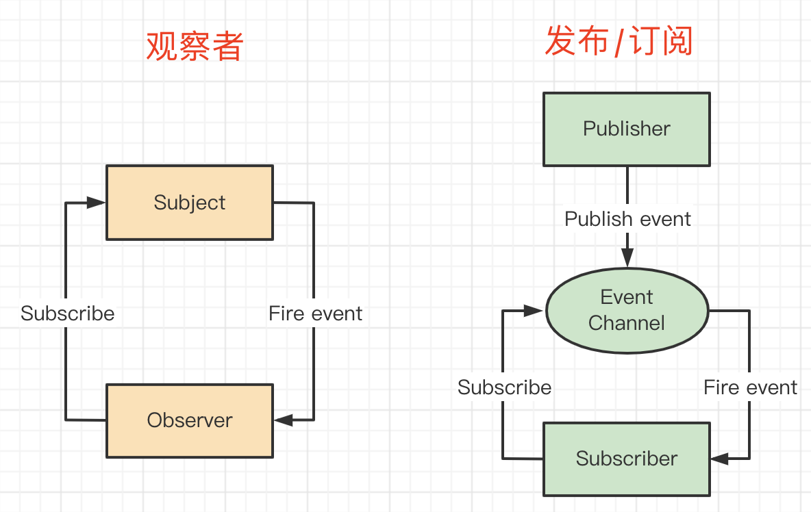

# 观察者模式 vs 发布订阅模式 区别



观察者模式：我只是在一直观察，什么时候触发不是我决定的。

发布订阅模式：既可以发布又可以订阅，可以观察操作后的回调，也可以主动去触发这个事件。

```js
// 绑定
event.on('event-key', () => {
    // 事件1
})
event.on('event-key', () => {
    // 事件2
})

// 触发执行
event.emit('event-key')
```
一个很明显的特点：发布订阅模式需要在代码中触发 `emit` ，而观察者模式没有 `emit`


# 发布订阅模式

发布订阅模式，没有在传统 23 种设计模式中，它是观察者模式的另一个版本。

实际工作中，不会区分的那么细致。


# 场景-自定义事件-Vue2

Vue2 实例本身就支持[自定义事件]

```js
const hookRE = /^hook:/
/**
 * @param {*} event 单个的事件名称 或 多个事件名组成的数组
 * @param {*} fn 当 event 被触发时执行的回调函数
 * @returns 
 */
Vue.prototype.$on = function (event: string | Array<string>, fn: Function): Component {
  const vm: Component = this

  // 判断 $on 第一个参数是不是数组，由此可以知道可以传递一个事件数组 this.$on(["submit", "commit"], this.handleEvents)
  if (Array.isArray(event)) {
    // 遍历这些事件，递归调用 $on
    for (let i = 0, l = event.length; i < l; i++) {
      vm.$on(event[i], fn)
    }
  } else {
    
    // 将 事件和回调 以键值对的形式存储到 vm._event 对象 vm._event = { eventName: [fn1, fn2] }
    
    // 一个事件也可以对应多个回调
    // 例如 this.$on('ev1', fn1)
    // 例如 this.$on('ev1', fn2)
    (vm._events[event] || (vm._events[event] = [])).push(fn)

    // hookEvent，提供从外部为组件实例注入声明周期方法的机会
    // 比如从组件外部为组件的 mounted 方法注入额外的逻辑
    // 该能力是结合 callhook 方法实现的
    // 例如 <com @hook:mounted="handleHookMounted" />
    if (hookRE.test(event)) {
      // 标记当前组件实例存在 hook event
      vm._hasHookEvent = true
    }
  }
  return vm
}

```

```js
/**
 * @param {*} event 事件名
 * @returns 
 */
Vue.prototype.$emit = function (event: string): Component {
  const vm: Component = this
  if (process.env.NODE_ENV !== 'production') {

    // 将事件名转换为小写
    const lowerCaseEvent = event.toLowerCase()

    // 意思是说，HTML 属性不区分大小写，所以你不能使用 v-on 监听小驼峰形式的事件名（eventName），而应该使用连字符形式的事件名（event-name)
    if (lowerCaseEvent !== event && vm._events[lowerCaseEvent]) {
      tip(
        `Event "${lowerCaseEvent}" is emitted in component ` +
        `${formatComponentName(vm)} but the handler is registered for "${event}". ` +
        `Note that HTML attributes are case-insensitive and you cannot use ` +
        `v-on to listen to camelCase events when using in-DOM templates. ` +
        `You should probably use "${hyphenate(event)}" instead of "${event}".`
      )
    }
  }

  // 从 vm._event 对象上拿到当前事件的回调函数数组
  let cbs = vm._events[event]
  if (cbs) {
    cbs = cbs.length > 1 ? toArray(cbs) : cbs

    // 拿到当前事件传入的参数 this.$emit(eve, '123')
    const args = toArray(arguments, 1)
    const info = `event handler for "${event}"`

    // 一次性调用 数组中的回调函数，并且传递提供的参数
    for (let i = 0, l = cbs.length; i < l; i++) {
      // 执行，里面做了些异常处理，最后里面其实还是 cb.apply()
      invokeWithErrorHandling(cbs[i], vm, args, vm, info)
    }
  }
  return vm
}

```


## 场景-postMessage 通讯

全局安装 npm i http-server -g
目录执行 http-server -p 8881
浏览器访问 http://localhost:8881/demo.html

通过 `window.postMessage` 发送消息。第二个参数，可以限制域名，如发送敏感信息，要限制域名。

```js
// 父页面向 iframe 发送消息
window.iframe1.contentWindow.postMessage('hello', '*') 

// iframe 向父页面发送消息
window.parent.postMessage('world', '*')
```

可监听 `message` 来接收消息。可使用 `event.origin` 来判断信息来源是否合法，可选择不接受。

```js
window.addEventListener('message', event => {
    console.log('origin', event.origin) // 通过 origin 判断是否来源合法
    console.log('child received', event.data)
})
```
